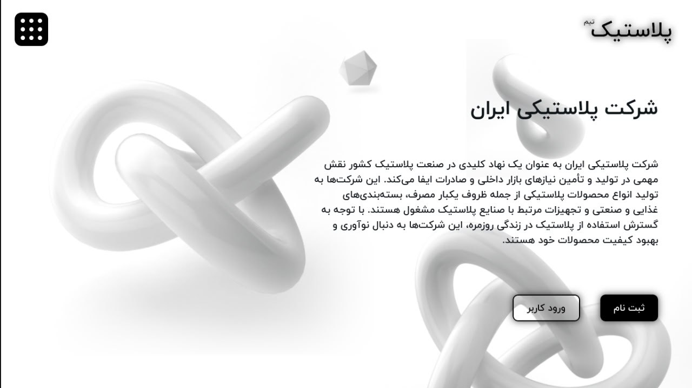

# Plastic-pics

<div align="right" dir="rtl">

<div align="center">

  

  <br />


  

</div>

---

## 💎 درباره پروژه

**پنل مدیریت تیم پلاستیک** یک راهکار جامع برای مدیریت شرکت‌های فعال در صنعت پلاستیک و پلیمر ایران است. این پلتفرم با هدف یکپارچه‌سازی فرآیندهای تولید، تأمین نیازهای بازار داخلی و مدیریت صادرات طراحی شده است.

### ✨ قابلیت‌های کلیدی

* **🏢 مدیریت چندشرکتی:** امکان کنترل و نظارت بر چندین واحد تولیدی به صورت همزمان.
* **📊 پایش تولید:** مدیریت محصولات بسته‌بندی و تجهیزات صنعتی.
* **🎨 رابط کاربری RTL:** طراحی کاملاً بومی‌سازی شده و راست‌چین.

---

## 🛠️ تکنولوژی‌های مورد استفاده

<div align="center">
  
</div>

---

## 🚀 راه‌اندازی پروژه

برای کلون کردن و اجرای سریع پروژه، دستورات زیر را به ترتیب در ترمینال اجرا کنید:

```bash
# کلون کردن مخزن
git clone [https://github.com/your_username/repo_name.git](https://github.com/your_username/repo_name.git)

# ورود به پوشه پروژه و نصب پکیج‌ها
cd repo_name
npm install

# اجرای پروژه در حالت توسعه
npm run dev